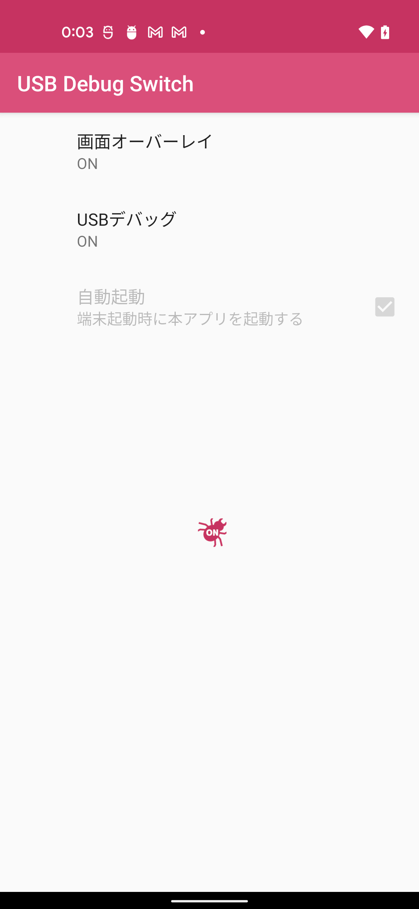
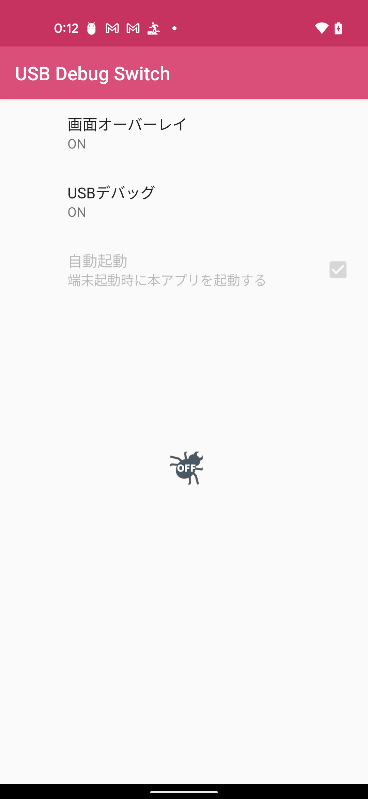
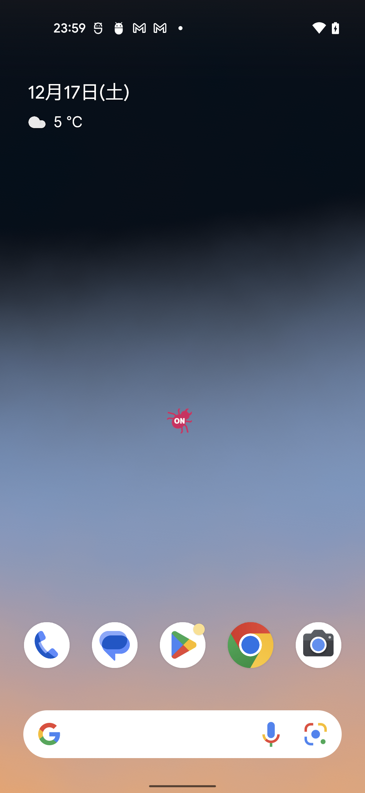
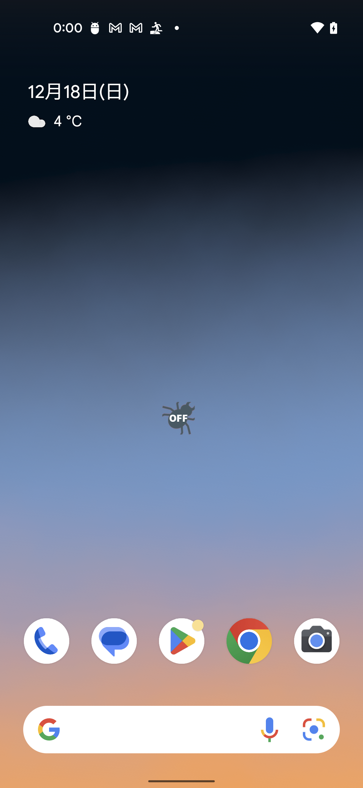
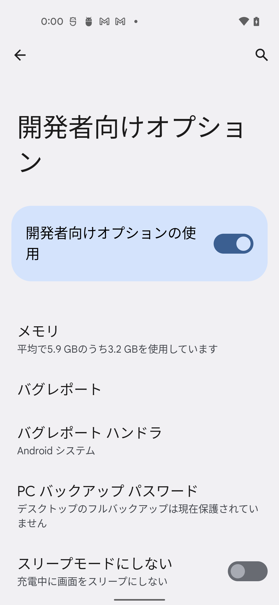
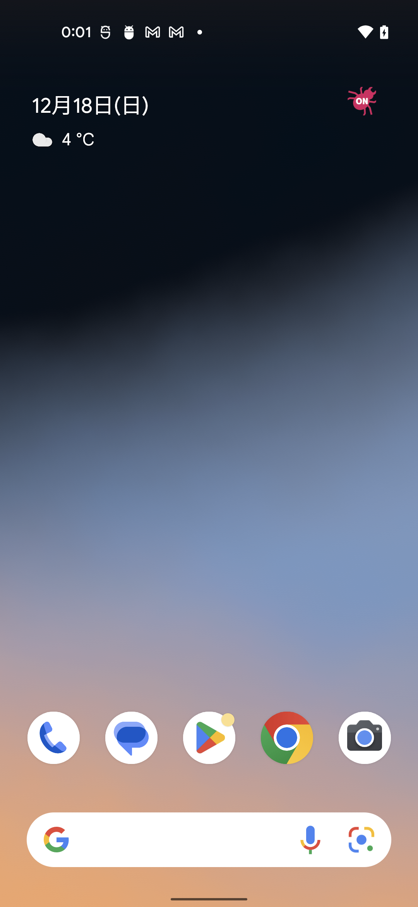

# UsbDebugSwitch
USB デバッグ の ON・ OFF 状態を常に端末の画面に表示し、素早くON・ OFF を切り替えられる Android アプリです。

使い方
----------

「画面オーバーレイ」を ON に設定するとオーバーレイアイコンが表示されます。オーバーレイアイコンは USB デバッグの有効・無効状態を示します。  
  

オーバーレイアイコンは本アプリがバックグラウンドに移動しても、本アプリが終了しても常に表示されます。  
  

オーバーレイアイコンをタップすると設定アプリが起動され、USBデバッグの有効/無効を切り替えることができます。  

オーバーレイアイコンはドラッグ＆ドロップで任意の場所に移動させることができます。

謝辞
----------

Icons made by <a href="https://www.flaticon.com/authors/flat-icons" title="Flat Icons">Flat Icons</a> from <a href="https://www.flaticon.com/" title="Flaticon">www.flaticon.com</a> is licensed by <a href="http://creativecommons.org/licenses/by/3.0/" title="Creative Commons BY 3.0" target="_blank">CC 3.0 BY</a>

