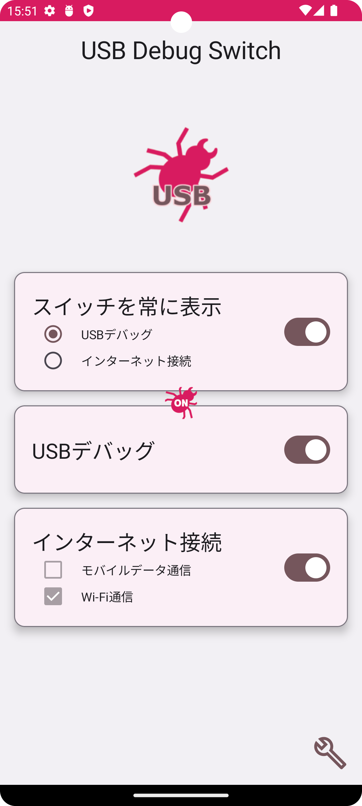
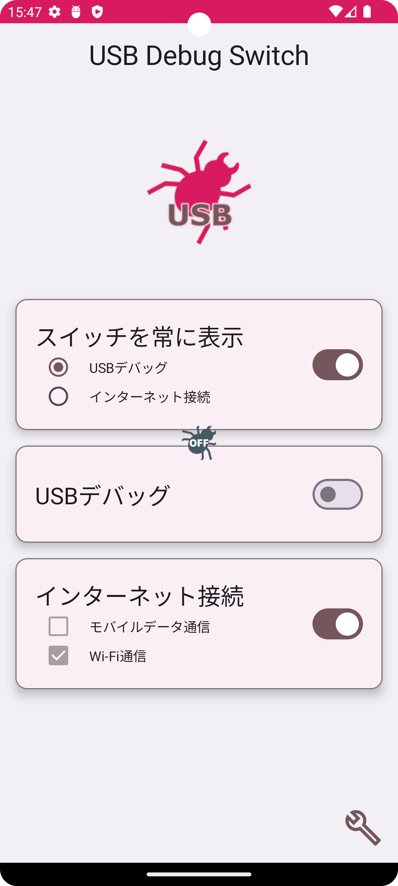

# Usb Debug Switch
USB デバッグ の ON・ OFF 状態を常に端末の画面に表示し、素早く ON・OFF を切り替えられる Android アプリです。
v0.14.0 からインターネット接続(Wi-Fi接続のみ)の ON・OFF 切り替え機能を追加しました。

使い方
----------

「画面オーバーレイ」設定において、「USB デバッグ」を選択した状態で トグルスイッチを ON に設定するとオーバーレイアイコンが表示されます。オーバーレイアイコンは USB デバッグの有効・無効状態を示します。  
  

オーバーレイアイコンは本アプリがバックグラウンドに移動しても常に表示されます。  
  

オーバーレイアイコンをタップすると開発者向けオプション画面が起動し、USBデバッグの有効/無効を切り替えることができます。  
【注意】予め開発者向けオプションを有効にしてください。([開発者向けオプションを有効にする方法](https://developer.android.com/studio/debug/dev-options?hl=ja#enable))  

オーバーレイアイコンはドラッグ＆ドロップで任意の場所に移動させることができます。

謝辞
----------

Icons made by <a href="https://www.flaticon.com/authors/flat-icons" title="Flat Icons">Flat Icons</a> from <a href="https://www.flaticon.com/" title="Flaticon">www.flaticon.com</a> is licensed by <a href="http://creativecommons.org/licenses/by/3.0/" title="Creative Commons BY 3.0" target="_blank">CC 3.0 BY</a>

